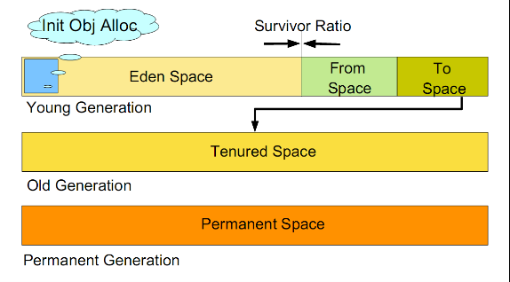

# 继承、抽象类与接口区别、访问控制、多态相关
1. 接口和抽象类的区别

* 语法层次：

抽象类中可以拥有任意范围的成员数据，可以定义非抽象方法。而接口中只能拥有静态的不能修改的成员数据，同时所有的方法必须是抽象的。所以说接口是抽象类的一种特例。
* 跨域不同

抽象类是对类的整体进行抽象，包括类的属性和行为。接口是对类的局部（行为）进行抽象。
抽象类是is-a，跨域的是具有相似特点的类。接口是like-a，可以跨域不同的类。
例如猫、狗可以抽象成一个动物类的抽象类，具备叫的方法。鸟、飞机可以实现Fly接口，具备飞的行为。
* 设计层次

抽象类是自下而上的一种设计思想，而接口是自顶而下的一种设计思想。
抽象类中我们要知道子类才能抽象出父类。而接口不同，它只需要定义一个规则即可。

2. 是否可以实现多个接口，是否可以继承多个抽象类。

Java可以实现多个接口，但是对于类是单继承体系结构。

3. 静态内部类和内部类的不同

静态内部类没有了指向外部类的引用，可以直接被实例化而不需要依附于外部类的实例化。
非静态内部类保留了指向外部类的引用，必须依附于外部类的实例化才能够实例化内部类。

静态嵌套类内部中：内部类不能访问外部类的非静态成员。外部类不能直接访问静态类中的属性，需要通过内部类去访问。

非静态内部类中：内部类可以直接访问外部类的属性成员。外部类不能直接方位静态类中的属性，需要通过内部类去访问。

延伸：使用内部类最吸引人的原因是：每个内部类都能独立地继承一个类，所以无论外围类是否已经继承某个类，对内部类都没有影响。

内部类：成员内部类（直接在外部类中）、局部内部类（内部类在方法或者作用域中）、嵌套内部类（static修饰的内部类）、匿名内部类。

4. 局部内部类和匿名内部类访问局部变量时，为何需要加final关键字？

局部变量的生命周期与局部内部类的对象的生命周期的不一致性。例如内部类innerClass在方法f()中，而方法f()中定义局部变量i且被内部类使用。当方法f()运行结束后，局部变量i就已经死亡不存在了，但局部内部类对象可能还存在（直到没有人再引用该对象才会消亡）,这时出现一种情况就是局部内部类要访问一个已经不存在的局部变量。而当变量被final修饰时，通过final将局部变量“复制”一份，复制品直接作为局部变量中的数据成员。

5. Overload和Override的区别。Overloaded的方法是否可以改变返回值的类型？

overload重载和override重写是Java多态性的不同表现。
overload是一个类多态性的表现，override是父类和子类多态性的表现。
override：子类中定义与父类相同的名称及签名。

overload：方法相同，方法签名不同。
注意：不能通过访问权限、返回类型、抛出的异常进行重载。
static修饰的方法不能够被重写。

6. abstract的method是否可同时是static，是否可同时是native，是否可同时是synchronized

都不可以。因为abstract申明的方法是要求子类去实现的，abstract只是告诉你有这样一个接口，你要去实现，至于你的具体实现可以使native和synchronized，也可以不是。抽象方法是不关心这些事的，所以写这两个是没有意义的。然后，static方法是不会被重写的，而abstract方法正是要子类去重写它，所以也是没有意义的。所以，总的来说，就是java语法不允许你这样做，事实上，也没有这样做的意义。

abstract需要重写，static为类方法，没有重写一说

abstract为没有实现的方法，native为本机实现的方法，自相矛盾。

abstract方法没有实现，也不可能实际调用抽象方法，没有必要synchronized修饰，当然子类可以根据需要同步该方法。

7. 接口是否可以继承接口？抽象类是否可以实现接口？抽象类是否可以继承实体类？

接口可以继承接口。

抽象类可以实现接口。

抽象类可以继承实体类，但前提是实体类必须有明确的构造函数。

8. 构造器Constructor是否可被override？

构造器Constructor不能被继承，因此不能重写（Override），但可以被重载（Overload）。

9. 启动一个线程是用run()还是start()？

启动一个线程是调用start()方法，使线程所代表的的虚拟处理机处于可运行状态，这意味着它可以由JVM调度并执行。这并不意味着线程就会立即运行。run()方法可以产生必须退出的标志来停止一个线程。

10. 作用域public，protected，private，以及不写时的区别？

不写时默认是包权限。

作用域 | 当前类 | 同一package | 子孙类 | 其他package
:-: | :-: | :-: | :-: |:-:
public | √ | √ | √ | √ |
protected | √ | √ | √ | × |
friendly | √ | √ | × | × |
private | √ | × | × | × |

这里需要说明的是，在同一个package，public、protected、friendly使用范围一致。而在其他package中，只有子孙类中的protected才能被访问。

# collections相关的数据结构及API
1. 列举几个Java Collection类库中的常用类

Collection是java.util中的一个接口，继承自Iterable。

子接口：List、Set、Queue...

实现类：ArrayList、LinkedList、HashSet、TreeSet、Vector、Stack

其他相关类：Iterator、TreeMap、HashTable、HashMap

Collection接口是最基本的集合接口，它不提供直接的实现，Java SDK提供的类都是继承自Collection的“子接口”。如List和Set。Collection所代表的是一种规则，它所包含的元素都必须遵循一条或者多条规则。如有些允许重复而有些则不能重复，有些必须要按照顺序插入而有些则是散列，有些支持排序但有些则不支持。

2. List、Set、Map是否都继承自Collection接口？

List、Set继承自Collection接口，而Map不是。

* List所代表的是有序的Collection。实现List接口的集合主要有：ArrayList、LinkedList、Vector、Stack。
* Set是一种不包括重复元素的Collection。实现了Set接口的集合有：EnumSet、HashSet、TreeSet。
* Map与List、Set接口不同，它是由一系列键值对组成的集合，提供了key到value的映射。同时它也没有继承Collection。实现Map的有：HashMap、TreeMap、HashTable、Properties、EnumMap。

3. HashMap和HashTable的区别。

* 历史原因：HashTable是基于陈旧的Dictionary类的，HashMap是Java1.2引进的Map接口的一个实现。
* 同步性：HashTable是线程安全的，也就是说是同步的，而HashMap是线程不安全的，不是同步的。
* 值：只有HashMap可以将空值作为一个表的条目的key或value。

* HashTable的方法是同步的，在方法的前面都有Synchronized来同步；HashMap未经同步，所以在多线程场合要手动同步。
* HashTable不允许null值（key和value都不可以），HashMap允许null值（key和value都可以）。
* HashTable有一个contains（Object value）功能和contaiValue（Object value）功能一样。
* HashTable使用Enumeration进行遍历，HashMap使用Iterator进行遍历。
* HashTable中hash数组默认大小是11，增加的方式是old*2+1。HashMap中hash数组的默认大小是16，而且一定是2的指数。
* hash值的使用不同，HashTable直接使用对象的hashCode，代码是这样的：

```java
int hash = key.hashCode();
int index = (hash & 0X7FFFFFFF) % tab.length;
```
而HashMap重新计算hash值，而且用与代替求模：

```java
int hash = hash(k);
int i = indexFor(hash, table.length);
static int hash(Object x) {
    h ^= (h >>> 20) ^ (h >>> 12 );
    return h ^ (h >>> 7) ^ (h >>> 4);
}
```

* 延展： 

### HashMap与HashSet的关系
* HashSet底层是采用HashMap实现的
```java
public HashSet() {
    map = new HashMap<E,Object>();
}
```        
* 调用HashSet的add方法时，实际上是向HashMap中增加了一行（key-value对），该行的key就是向HashSet增加的那个对象，该行的value就是一个Object类型的常量。

```java
private static final Object PRESENT = new Object();
public boolean add(E e) {
    return map.put(e, PRESENT) == null;
}

public boolean remove(Object o) {
    return map.remove(o) = PRESENT;
}
```

### HashMap和ConcurrentHashMap的关系
ConcurrentHashMap也是一种线程安全的集合类，它和HashTable也是有区别的，主要区别就是加锁的粒度以及如何加锁。ConcurrentHashMap的加锁粒度要比HashTable更细一点。将数据分成一段一段地存储，然后给每一段数据配一把锁，当一个线程占用锁访问其中一个段数据的时候，其他段的数据也能被其他线程访问。

4. HashMap中是否任何对象都可以作为key，用户自定义对象作为key有没有什么要求？

用户自定义的对象当做key需要实现Map中的hashCode和Equals方法。

HashMap用哈希值来存储和查找键值对。

当插入一个Entry时，HashMap会计算Entry key的哈希值。Map会根据这个哈希值把Entry插入到相应的位置。

查找时，HashMap通过计算key的哈希值到特定的位置查找这个Entry。

如果我们再使用自定义对象作为key时，我们需要保证当改变对象的状态的时候，不改变它的哈希值。

5. COllection和Collections的区别

Collection是一个接口，它是各种集合结构的父接口。

Collections是一个包装类，它包含有各种有关集合操作的静态方法。Collections不能被实例化，它的构造函数是私有的。

# 异常体系
1. Error、Exception和RuntimeException的区别，作用又是什么？列举3个以上的RuntimeException

Throwable是Java语言中所有错误和异常的超类。它有两个子类：Error、Exception。

Error为错误的意思，是程序无法处理的，如OutOfMemoryErro、ThreaDeath等。出现这种情况你唯一能做的就是听之任之，交由JVM来处理，不过JVM在大多数情况下会选择中止线程。

Exception是程序可以处理的异常，分为CheckedException（受检异常），另一种是UncheckedException（不受检异常）。其中CheckException是发生在编译阶段，必须要使用try...catch（或者throws），否则编译不通过。

而UncheckedException发生在运行期，具有不确定性，主要是由程序的逻辑问题引起的，难以排查，我们一般需要纵观全局才能够发现这类的异常错误。所以在程序设计中我们需要认真考虑，尽量处理异常，即使产生了异常，也能尽量保证程序朝着有利方向发展。

RunTimeException是那些可能在Java虚拟机正常运行期间抛出的异常的超类。可能在执行方法期间抛出但未被捕获的RuntimeException的任何子类都无需在throws子句中进行生命。它是Exception的子类。

常见的RuntimeException：
* NullPointerException - 空指针引用异常
* ClassCastException - 类型强制转换异常
* IllegalArgumentException - 传递非法参数异常
* ArithmeticException - 算数运算异常
* ArrayStoreException - 向数组中存放与生命类型不兼容对象异常
* IndexOutOfBoundsException - 下标越界异常
* NegativeArraySizeException - 创建一个大小为负数的数组错误异常
* NumberFormatException - 数字格式异常
* SecurityException - 安全异常
* UnsupportedOperationException - 不支持的操作异常

2. Java中的异常处理机制的简单原理和应用

当Java程序违反了Java 的语义规则时，Java虚拟机就会将发生的错误表示为一个异常。

违反语义规则包括两种情况：
* 一种是Java类库内置的语义检查
* 另一种情况就是Java允许程序员扩展这种语义检查，程序员可以创建自己的异常，并自由选择在何时用throw关键字引发异常。

所有的异常都是java.lang.Throwable的子类

3. 内存溢出和内存泄漏

内存溢出：指在指定大小的内存空间，写入了超出大小的数据，从而导致了内存溢出。通俗地说，就是内存不够，没办法支持当前程序。

当发生内存溢出时，程序将无法进行，强制终止。

内存泄漏：指某个程序已不再执行，却始终占用着内存，不释放，从而消耗着资源，称其为内存泄漏。

当发生内存泄漏时，可用内存会逐渐减少，从而降低性能。

对于内存溢出可能发生的情况，大概有几种：
* 在程序中存在死循环，或者循环过多，而产生了过多重复的对象的实例。
* 存在对象的引用，使用完后没有清除，导致Java虚拟机不能回收。
* 一次操作时，在内存中加载了大量的数据，原则上说，在Java中，由于它的自动垃圾回收机制，出现内存溢出的可能性并不是很大。

对于内存泄漏可能发生的情况，大概有几种：
* 长生命周期的对象持有短生命周期的引用。

这是内存泄漏最常见的场景，也是代码设计中经常出现的问题。

例如：在全局静态map中缓存局部变量，且没有清空操作，随着时间的推移，这个map会越来越大，造成内存泄漏。
* 修改HashSet中对象的参数值，且参数是计算哈希值的字段。

当一个对象被存储进HashSet集合中以后，就不能修改这个对象中的那些参与计算哈希值的字段，否则对象修改后的哈希值与最初存储进HashSet集合中时的哈希值就不同了，在这种情况下，即使在contains方法使用该对象的当前引用作为参数去HashSet集合中检索对象，也将返回找不到对象的结果，这也会导致无法从HashSet集合中删除当前对象，造成内存泄漏。
* 机器的连接数和关闭时间设置

长时间开启非常耗费资源的链接，也会造成内存泄漏。

解决方案：
* 尽早释放无用对象的引用
* 使用字符串处理，避免使用String，应大量使用StringBuffer，每一个String对象都得独立占用内存一块区域。
* 尽量少用静态变量，因为静态变量存放在永久区（方法区），永久区基本不参与垃圾回收。
* 避免在循环中创建对象。
* 开启大型文件或者从数据库中一次拿了太多的数据很容易造成内存溢出，所以在这些地方要大概计算一下数据量的最大值是多少，并且设定所需最小及最大的内存空间值。

# 其他
1. String和StringBuffer、StringBuilder的区别

* 可变性与不可变化性

String累中使用字符数组保存字符串，因为有final修饰，所以String是不可变的。

StringBuilder和StringBuffer的公共父类是AbstractStringBuilder类，在AbstractStringBuilder中也是使用字符数组保存字符串，可是这两种对象都是可变的。
* 是否多线程安全

String中对象是不可变的，也可以理解为常量，显然是线程安全的。

StringBuffer对方法加了同步锁或者对调用的方法加了同步锁，所以是安全的。

StringBuilder并没有对方法进行加同步锁，所以是非线程安全的。

2. String s = "123";这个语句有几个对象产生

创建了一个对象，将"123"存储到常量池中。
* 延伸： String s = new String("abc")这个语句创建了几个对象？

这种题目主要就是为了考察队字符串对象的常量池掌握与否。上述的语句中是创建了两个对象，第一个对象是"abc"字符串存储在常量池中，第二个对象是Java Heap中的String对象。

3. reader和inputStream的区别

首先要粪青reader和inputStream，一个是读取字符流，一个是读取字节流。

inputStream是表示字节输入流的所有类的超类，Reader是用于读取字符流的抽象类。

inputStream提供的是字节流的读取，而非文本读取，这是和Reader类的根本区别。

即用Reader读取出来的是char数组或者String，使用InputStream读取出来的是byte数组。

4. ==和equals的区别

* 基本数据类型，也称原始数据类型，如：byte，short，char，int，long，float，double，boolean，他们之间的比较，应该用==，比较的是他们的值。
* 复合数据类型（类），当他们用==进行比较的时候，比较的是他们在内存中存放的地址，所以，除非是同一个new出来的对象，他们的比较后的结果就为true，否则比较后的结果为false。

Java当中所有的类都是继承于Object这个基类的，在Object中的基类定义了一个equals的方法，这个方法的初始行为是比较对象的内存地址，但在一些类库当中，这个方法被覆盖掉了，如String，Integer，Date在这些类当中equals有其自身的实现，而不再是比较类在堆内存中存放的地址了。

对于复合数据类型之间进行equals比较，在没有覆写equals方法的情况下，他们之间的比较还是基于他们在内存中的存放位置的地址值的，因为Object的equals方法也是用==进行比较的，所以比较厚的结果跟==的结果相同。

对于String覆写Object的equals方法，只是比较字符串值是否相等。

5. hashCode的作用

很多地方都会利用到hash表来提高查找效率。在Java的Object类中有一个方法：

public native int hashCode();

hashCode方法的主要作用是为了配合基于散列的集合一起正常运行，这样的散列集合包括HashSet、HashMap以及HashTable。

考虑一种情况，当向集合中插入对象时，如何判别在集合中是否已经存在该对象了？（注意：集合中不允许重复的元素存在）

当集合要添加新的对象时，先调用这个对象的hashCode方法，得到对应的hashCode值，实际上在HashSet的具体实现中会用一个table保存已经存进去的对象的hashCode值，如果table中没有该hashCode值，它就可以直接存进去，不用再进行任何比较了；如果存在该hashCode值，就调用它的equals方法与新元素进行比较，相同的话就不存了，不相同就散列它的地址，这样一来实际调用equals方法的次数就大大降低了。说通俗一点：Java中的hashCode方法就是根据一定的规则将与对象相关的信息（比如对象的存储地址，对象的字段等）映射成一个数值，这个数值称作为散列值。

6. hashCode和equals方法的关系
在有些情况下，程序设计者在设计一个类的时候会需要重写equals方法，比如String类。但是千万要注意，在重写equals方法的同时，必须重写hashCode方法。

也就是说对于两个对象，如果调用equals方法得到的结果为true，则两个对象的hashCode值必定相等；

如果equals方法得到的结果为false，则两个对象的hashCode值不一定不同；

如果两个对象的hashCode值不等，则equals方法得到的结果必定为false；

如果两个对象的hashCode值相等，则equals方法得到的结果未知。

7. Object类中有那些方法，列举3个以上

Object方法：equals()、toString()、finalize()、hashCode()、getClass()、clone()、wait()、notify()、notifyAll()    

8. char型变量中能不能存储一个中文汉字？为什么？

char类型变量是能够定义成为一个中文的，因为Java中以unicode编码，一个char占16个字节，所以放一个中文是没有问题的。

9. 如何在字符流和字节流之间转换？

InputStreamReader是字节流向字符流的桥梁，它使用指定的charset读取字节并将其解码为字符。

OutputStreamWriter是字符流向字节流的桥梁，它使用指定的charset将要写入流中的字符编码成字节，它使用的字符集可以由名称指定或显式给定，否则将接受默认的字符集。

10. 多线程与死锁

实现多线程的几种方式：集成Thread/实现Runnable接口。

所谓死锁：是指两个或两个以上的进程在执行过程中，因争夺资源而造成的一种互相等待的现象，若无外力作用，它们都将无法推进下去。

# Java高级
## 多线程
1. 多线程的实现方式，有什么区别

Java中可以通过继承Thread和实现Runnable接口来实现多线程。

两者的区别：

* 一个类只能继承一个父类，存在局限；一个类中可以实现多个接口。
* 在实现Runnable接口的时候调用Thread的Thread(Runnable run)或者Thread(Runnable run, String name)构造方法创建进程时，使用同一个Runnable实例，所以建立的多线程的实例变量是可以共享的。

2. 同步和并发是如何解决的

使用Synchronized来起到同步加锁的作用

使用volatile关键字来声明类属性

3. 什么叫守护线程，用什么方法实现守护线程（Thread.setDeamon()的含义）

在Java中有两类线程：User Thread（用户线程）、Deamon Thread（守护线程）

用个比较通俗的说法，任何一个守护线程都是整个JVM中所有非守护线程的保姆

只要当前JVM实例中尚存在任何一个非守护线程没有结束，守护线程就全部工作；只有当最后一个非守护线程结束时，守护线程随着JVM一同结束工作。

JVM内部的实现是如果运行的程序只剩下守护线程的话，程序将终止运行，直接结束。所以守护线程是作为辅助线程存在的，主要的作用是提供计数等等辅助的功能。

4. 如何停止一个线程？

终止线程的三种方法：
* 使用退出标志，使线程正常退出，也就是当run方法完成后线程终止。

在定义退出标志exit时，使用了一个Java关键字volatile，这个关键字的目的是使exit同步，也就是说在同一个时刻，只能由一个线程来修改exit的值。

* 使用stop方法强行终止线程（这个方法不推荐使用，因为stop和suspend、resume一样，也可能发生不可预料的结果）。

使用stop方法可以强行终止正在运行或挂起的线程。我们可以使用如下的代码来终止线程：

thread.stop();

虽然使用上面的代码可以终止线程，但使用stop方法是很危险的，就像突然关闭计算机电源，而不是按正常程序关机一样，可能会产生不可预料的结果，因此，并不推荐使用stop方法来终止线程。

* 使用interrupt方法中断线程

使用interrupt方法来中断线程可分为两种情况：

(1)线程处于阻塞状态，如使用了sleep方法

(2)使用while(! isInterrupted()){...}来判断线程是否被中断。

在第一种情况下使用interrupt方法，sleep方法将抛出一个InterruptedException异常，而在第二种情况下线程将直接退出。

注意：在Thread类中有两个方法可以判断线程是否通过interrupt方法被终止。一个是静态方法interrupted()，一个是非静态的方法isInterrupted()，这两个方法的区别是interrupted用来判断当前线程是否被中断，而isInterrupted可以用来判断其他线程是否被中断。因此，while(!isInterrupted())也可以换成while(!Thread.interrupted())

5. 解释一下什么是线程安全？举例说明一个线程不安全的离子。解释Synchronized关键字的作用。

线程安全就是多线程访问时，采用了加锁机制，当一个线程访问该类的某个数据时，进行保护，其他线程不能进行访问直到该线程读取完，其他线程才可使用。不会出现数据不一致或者数据污染。

线程不安全就是不提供数据访问保护，有可能出现多个线程先后更改数据，造成所得到的数据时脏数据。

在多线程的情况下，由于同一进程的多个线程共享同一片存储空间，在带来方便的同时，也带来了访问冲突这个严重的问题。Java语言提供了专门机制以解决这种冲突，有效避免了同一个数据对象被多个线程同时访问。

由于我们可以通过private关键字来保证数据对象只能被方法访问，所以我们只针对方法提出一套机制，这套机制就是synchronized关键字，它包括两种用法：synchronized方法，和synchronized块。

6. 当一个线程进入一个对象的一个synchronized 方法后，其他线程是否可进入此对象的其他方法？

可进入其他对象的非synchronized方法，但是如果有其他有加synchronized的方法将处于阻塞状态。

# 内存结构，GC
1. GC的概念，如果A和B对象循环引用，是否可以被GC？

两个对象相互引用，和会不会被GC没有直接关系。采用的GC Roots可达性来决定是否会被GC回收。

现在的GC都采用分代收集的方式，不同的区采用不同的算法，大致有：复制，标记-清扫，标记-压缩，标记-清扫-压缩等。

2. Java中的内存溢出是如何造成的

jvm管理的内存大致包括三种不同类型的内存区域：Permanent Generation Space（永久保存区域）、Heap Space（堆区域）、Java Stacks（Java栈）。

其中永久保存区域主要存放Class（类）和Meta的信息。Class第一次被Load的时候被放入PermGen Space区域，Class需要存储的内容主要包括方法和静态属性。

堆区域用来存放Class的实例（即对象），对象需要存储的内容主要是非静态属性。每次用new创建一个对象实例后，对象实例存储在堆区域中，这部分空间也被jvm的垃圾回收机制管理。

而Java栈跟大多数变成语言的栈功能相似，主要存储基本类型变量以及方法的输入输出参数。Java程序的每个线程中都有一个独立的堆栈。容易发生内存溢出问题的内存空间包括Permanent Generation Space和Heap Space。

第一种OutOfMemoryError：PermGen Space

发生这种问题的原因是程序中使用了大量的jar或class，使java虚拟机装载类的空间不够，与Permanent Generation Space有关。解决这类问题有以下两种方法：

* 增加java虚拟机中的XX：PermSize和XX：MaxPermSize参数的大小，其中XX：PermSize是初始永久保存区域大小，XX：MaxPermSize是最大永久保存区域大小。
* 清理应用程序中web-inf/lib下的jar如果tomcat部署了多个应用，很多应用都使用了相同的jar，可以将共同的jar移到tomcat共同的lib下，减少类的重复加载。

第二种OutOfMemoryError：Java Heap Space

发生这种问题的原因是Java虚拟机创建的对象太多，在进行垃圾回收之前，虚拟机分配的堆内存空间已经用满了，与Heap Space有关。解决这类问题有两种思路：

* 检查程序，看是否有死循环或不必要地重复创建大量对象。找到原因后，修改程序和算法。
* 增加Java虚拟机中Xms（初始堆大小）和Xmx（最大堆大小）参数的大小。

3. jvm GC如何判断对象是否需要回收，有哪几种方式？

* 引数计数（Reference Counting）

给对象添加一个引用计数器，每有一个地方引用这个对象，计数器值加1，每有一个引用失效则减1.

优点：实现简单，判断效率高。 缺点：难以解决对象之间循环引用的问题。

* 可达性分析（Reachability Analysis）

从GC Roots（每种具体实现对GC Roots有不同的定义）作为起点，向下搜索它们引用的对象，可以生成一棵引用树，树的节点视为可达对象，反之视为不可达。

JVM使用“可达性分析算法”来判断一个对象是否可以被回收，有两个细节需要注意：

（1） Java的GC Roots如何定义

Java中GC Roots包括以下几种对象：

a. 虚拟机栈（帧栈中的本地变量表）中引用的对象

b. 方法区中静态属性引用的对象。

c. 方法区中常量引用的对象。

d. 本地方法栈中JNI引用的对象。

（2） 不可达对象一定会被回收吗？

不是。执行垃圾回收前JVM会执行不可达对象的finalize方法，如果执行完毕之后该对象变为可达，则不会回收它。

但一个对象的finalize方法只会被执行一次。

4. 引用计数，对象引用遍历：jvm有哪几种垃圾回收机制？讲讲分代回收机制。

引用计数法（Reference Counting）：

引用计数器的实现很简单，对于一个对象A，只要有任何一个对象引用了A，则A的引用计数器就加1，当引用失效时，引用计数器就减1。只要对象A的引用计数器的值为0，则对象A就不可能再被使用。

但是引用计数器有一个严重的问题，即无法处理循环引用的情况。因此，在Java的垃圾回收器中没有使用这种算法。

分代回收（Generational Collection）：
JVM使用分代回收，是因为：不同的对象，生命周期是不一样的。因此不同生命周期的对象采用不同的收集方式可以提高垃圾回收的效率。



如图所示，虚拟机中公划分为三个代：年轻代（Young Generation）、年老代（Old Generation）和持久代（Permanent Generation）。其中持久代主要存放的事Java类的类信息，与垃圾收集要手机的Java对象关系不大。年轻代和年老代的划分是对垃圾收集影响比较大的。

### 年轻代
所有新生成的对象首先都是放在年轻代的。年轻代的目标就是尽可能快速的收集掉那些生命周期短的对象。年轻代分为三个区，一个Eden区，两个Survivor区（一般而言）。大部分对象在Eden区中生成。当Eden区满时，还存活的对象将被复制到Survivor区（两个中的一个）。当这个Survivor区满时，此区的存活对象将被复制到另外一个Survivor区。当这个Survivor区也满了的时候，从第一个Survivor区复制过来并且此时还存活的对象，将被复制到“年老区（Tenured）”。需要注意，Survivor的两个区是对称的，没有先后关系，所以同一个区中可能同时存在从Eden复制过来的对象和从前一个Survivor中复制过来的对象。而复制到年老区的只有从第一个Survivor区复制过来的对象。而且Survivor区总有一个是空的。同时，根据程序需要，Survivor区是可以配置为多个的（多于两个），这样可以增加对象在年轻代中的存活时间，减少被放到年老代的可能。

### 老年代
在年轻代中经历了N次垃圾回收后仍然存活的对象，就会被放到年老代中。因此，可以认为年老代中存放的都是一些生命周期较长的对象。

### 持久代
用于存放静态文件，如今Java类、方法等。持久代对垃圾回收没有显著影响，但是有些应用可能动态生成或者调用一些Class，在这种时候需要设置一个比较大的持久代空间来存放这些运行过程中新增的类。

## 什么情况下触发垃圾回收
由于对象进行了分代处理，因此垃圾回收区域、时间也不一样。GC有两种类型：Scavenge GC和Full GC。

### Scavenge GC
一般情况下，当新对象生成，并且在Eden申请空间失败时，就会触发Scavenge GC，对Eden区域进行GC，清除非存活对象，并且把尚且存活的对象移动到Survivor区。然后整理Survivor的两个区。这种方式的GC是对年轻代的Eden区进行，不会影响到年老代。因为大部分对象都是从Eden区开始的，同时Eden区不会分配的很大，所以Eden区的GC会频繁进行。因而，一般在这里需要使用速度快、效率高的算法，使Eden区能尽快空闲出来。

### Full GC
对整个堆进行，包括Young、Trnured和Perm。Full GC因为需要对整个堆进行回收，所以比Scavenge GC要慢，因此应该尽可能减少Full GC的次数。在对JVM调优的过程中，很大一部分工作就是对于Full GC的调节。有如下原因可能导致Full GC：
* 年老代（Tenured）被写满
* 持久代（Perm）被写满
* System.gc()被显式调用

# CLASSLOADER
1. ClassLoader的功能和工作模式

Java中的所有类，必须被装在到Jvm中才能运行，这个装在工具是由jvm中的类装载器完成的。类装载器所做的工作实质是把类文件从硬盘读取到内存中，jvm在加载类的时候，都是通过对ClassLoader的loadClass()方法来加载class的，loadClass使用双亲委派模式。

# NIO
1. IO和NIO本质的不同，在实际项目中的使用场景以及如何使用？

# 其他
1. hashCode有哪些算法？
2. 反射，是否可以调用私有方法，以及在框架中的运用
3. 知道泛型的实现机制吗？
4. Socket编程通常出现的异常有哪些？什么情况下回出现？
5. 了解JVM启动参数吗？-verbose -Xms -Xmx的意思是什么？
6. StringBuffer的实现方式，容量如何扩充
7. 代理机制的实现